# 共同編集ホワイトボード（デモ版・Unity WebGL）仕様書

リポジトリ名：**`shared-whiteboard-webgl-demo`**

---

## 1. 概要

### 1.1 課題

打合せの参加者全員が、同じホワイトボードに**同時に書き、同時に消せる**環境をブラウザ上で提供する。URL を共有するだけで参加でき、サインアップも設定も要しない。

打合せの共同ボードは、相手の線が書き終わるまで見えない・消したはずの線が相手の画面に残る・接続が切れた間の変更が抜ける、といった同期の破綻によって使い物にならなくなる。本成果物は、**描いている最中から全員に見え、誰が消しても全員から消え、切断後も欠落なく追いつく**共同編集を、動く展示物として体験可能にするものである。

### 1.2 対象エディション

**デモ版（アイデアの視覚化）**

技術と UX を体験させる展示物として、安全・手軽に動かせることを最優先する。デザイン・測定・保守・監視は対象外とする。

### 1.3 入力の位置づけ

主な入力はマウス・トラックパッドとする。ペンやタッチでも描けるが、筆圧・傾きは用いない。打合せで求められるのは、雑に描いても全員に読める線であり、書き味の作り込みではない。

---

## 2. プラットフォーム

### 2.1 指定

フロントエンドは **Unity WebGL** と利用者から明示的に指定されたため、選定を行わない。指示のゲーム項に定める構成（Unity WebGL・C#・PlayerPrefs・Unity Play・シーン／UI／オブジェクトのコード生成・CLI ビルド・ページロード時の日付確認）を適用する。

### 2.2 サーバー側の構成

共同編集は端末内で完結せず、参加者間で操作を配信・順序付けする中継と、操作ログを永続化する保管先を要する。これらはゲーム項の範囲外であるため、ウェブ項の構成からリアルタイム通信層とアプリケーション層を採用する。

| 層 | 技術 | デプロイ先 | 役割 |
|---|---|---|---|
| フロントエンド | Unity WebGL（C#） | Unity Play（無料） | 描画・履歴・送信キュー・書き出し |
| 入力・通信ブリッジ | jslib（Pointer Events・WebSocket・fetch） | Unity WebGL ビルドに同梱 | ブラウザ API と C# の橋渡し |
| 中継 | Gin（Go） | Railway（無料） | WebSocket 接続の維持、操作の順序確定と再配信、進行中ストローク・カーソルの配信 |
| アプリケーション | Rails | Railway（無料） | セッション・ボード・参加・操作ログの永続化・所有権検証・SQLite |

中継層を Go とするのは、1 ボードあたり最大 10 接続へ毎秒数十回の差分を低遅延で再配信する必要があり、高速並列処理・リアルタイム通信の要件に該当するためである。DB は SQLite とし、Rails のみが保持する。中継層とアプリケーション層の通信は自システム内の通信であり、外部 API に該当しない。フロントエンドから中継・アプリケーション層への通信も自システム内の通信である。

### 2.3 ブリッジの構成方針

Unity WebGL は、ブラウザのペン・タッチ入力の種別、WebSocket、任意のヘッダを付けた HTTP 要求を標準の経路で十分に扱えない。そのため以下を jslib のブリッジとして構成し、Unity 標準の入力経路は無効化する。

| ブリッジ | 内容 |
|---|---|
| 入力ブリッジ | Pointer Events を購読し、入力バッファへ蓄積。Unity が毎フレーム一括で取り出す |
| 通信ブリッジ | WebSocket の接続・送受信と、アプリケーション層への HTTP 要求。受信メッセージは受信バッファへ蓄積し、Unity が毎フレーム一括で取り出す |
| 環境ブリッジ | ページ URL のボードトークン取得、ページ非表示・終了の通知、ダウンロード、既定ジェスチャの抑止 |

### 2.4 セッションの扱い

Unity Play とサーバーは配信元が異なるため、Cookie によるセッション送信は成立しない。セッションキーは初回アクセス時にアプリケーション層が発行し、フロントエンドが PlayerPrefs に保持して、以後のすべての要求にヘッダとして付与する。セッションキーが DB レコードのオーナーキーである点はウェブと同一である。

---

## 3. 用語定義

| 用語 | 定義 |
|---|---|
| ボード | 1 枚のホワイトボード。無限キャンバスを持つ |
| ボードトークン | ボードごとに発行される推測不可能な不透明識別子。参加 URL の構成要素 |
| セッションキー | ブラウザごとに発行される不透明識別子。DB レコードのオーナーキー。PlayerPrefs に保持しヘッダで送る |
| 参加 | あるセッションがボードトークンによりボードに加わった状態。参加レコードで表す |
| 参加者ラベル | 参加者に割り当てる非個人ラベル（参加者 A・B・C…）と識別色 |
| ストローク | ポインタの接触から離脱までの 1 筆。点列・ツール・色・太さで構成される |
| 進行中ストローク | まだ確定していない、描画中のストローク。差分として配信されるが操作ログには載らない |
| ドット | 移動を伴わない接触から生成されるストローク。線幅の円として描画される |
| 操作 | ボードに対する 1 単位の変更。ストローク追加・ストローク消去・全消去の 3 種 |
| 操作ログ | ボードの操作を連番順に追記した列。ボードの内容はこの列から再構成される |
| 連番 | 中継サーバーがボードごとに操作へ採番する番号。全参加者の適用順序を確定する |
| 操作ID | 操作ごとにフロントエンド側で採番される推測不可能な識別子。再送の重複排除に用いる |
| 取消フラグ | 操作が Undo により無効化されていることを示す印。操作自体は削除しない |
| ハブ | 中継サーバー内でボードごとに存在する、接続の集合と直近の操作バッファ |
| 入力バッファ・受信バッファ | ブリッジがフレーム間に受け取った入力・メッセージを蓄積し、Unity が毎フレーム一括で取り出す領域 |
| 確定済み層 | 確定したストロークを焼き込んだ描画面（RenderTexture） |
| 進行中層 | 描画中のストローク（自分・他者）を描く描画面 |
| ワールド座標 | パン・ズームに依存しないキャンバス上の座標。点列はこの座標で保持する |

---

## 4. スコープ

### 4.1 対象

- ボードの作成と、参加 URL による参加（最大 10 人）
- ペン・マーカー・消しゴムの 3 ツール、色・太さの選択
- 描画中のストロークの即時配信（書き終わる前から全員に見える）
- 誰でも誰のストロークでも消せる消しゴム、全消去
- 自分の操作の Undo / Redo
- 参加者のカーソルとラベルの表示
- 切断・タブの非表示からの復帰と、欠落のない追いつき
- 操作ログの永続化と、参加 URL からの再開
- PNG 画像としての書き出し（ブラウザ内で生成）
- 日次リセットと、リセット後の通知

### 4.2 対象外

- ユーザー認証・認可、参加者の氏名入力
- テキスト・付箋・矢印・図形・画像の挿入
- ストローク単位ではない部分消去
- 音声・映像・チャット
- ボードの公開範囲の設定（参加 URL を知る者は全員参加できる）
- 参加者の権限区分（作成者と参加者に権限差を設けない）

---

## 5. システム構成

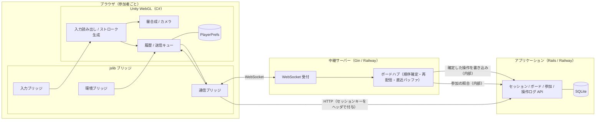

---

## 6. 所有権と共有の原則

**要件**

- DB のすべてのテーブルにセッションキーを付与し、参照条件に必ず含めること
- **セッションをまたぐ参照・操作は、参加レコードを持つボードに限り許可する。** 参加レコードのないボードのレコードには、ボード ID や操作 ID を知っていても一切到達できないこと
- 参加レコードは、ボードトークンを提示したセッションに対してのみ作成すること。ボードトークンは推測不可能な長さとし、ボード ID・セッションキーから導出しないこと
- 参加したセッションは、そのボードの全ストロークを参照でき、全ストロークを消去でき、自分の操作のみを取り消せること
- ボードは作成者のセッションに依存せず存続すること
- 中継サーバーは接続の確立時に、セッションキーとボードトークンの組が参加レコードと一致することをアプリケーション層へ照合し、一致しない接続を確立しないこと
- セッションキーはヘッダでのみ送り、URL のクエリ・フラグメントに含めないこと。参加 URL にはボードトークンのみを含めること

---

## 7. ブリッジ仕様

### 7.1 入力ブリッジ

**要件**

- Unity のキャンバス要素に対して pointerdown・pointermove・pointerup・pointercancel を購読し、ポインタ ID・種別・座標・押下ボタン・時刻を入力バッファへ追記すること
- 1 イベントに複数の座標が束ねられている場合、それらをすべて個別の点として追記すること
- 入力バッファは Unity 側が毎フレーム一括で取り出し、取り出し後に空にすること
- 接触中のポインタはキャンバス要素に捕捉し、キャンバス外へ出ても離脱までを追跡すること
- キャンバス要素と埋め込み先のページに対し、既定のジェスチャ（スクロール・ページズーム・長押しメニュー・ドラッグ選択）とホイールの伝播を抑止すること
- **Unity 標準のポインタ入力は無効化し、ブリッジのみを入力源とすること**

### 7.2 通信ブリッジ

**要件**

- WebSocket の接続・切断・送信・受信を担い、受信メッセージは受信バッファへ追記すること。Unity 側は毎フレーム一括で取り出すこと
- **タブが非表示になり Unity の更新が停止している間も受信を継続し、受信バッファに蓄積すること。** 復帰後に Unity が蓄積分を連番順に処理する
- 受信バッファには上限を設け、上限に達した場合はバッファを破棄して「再取得が必要」の印を立てること。復帰後に Unity が受信済み連番から追いつきを要求する
- HTTP 要求はセッションキーをヘッダに付与して送り、応答を Unity へ返すこと
- 接続の切断を Unity へ通知すること。再接続の判断と間隔の制御は Unity 側が行う

### 7.3 環境ブリッジ

**要件**

- ページ URL からボードトークンを読み取り、Unity のロード完了後に渡すこと。ロード完了前に読み取った値は保持し、失わないこと
- ページの非表示（visibilitychange）・終了（pagehide）を Unity へ通知すること。終了時は Unity の処理を待たず、未送信の操作を通信ブリッジから直接送出すること
- 生成した PNG をブラウザのダウンロードとして保存させること

---

## 8. 描画入力仕様

### 8.1 ポインタ種別ごとの扱い

| ポインタ種別 | 1 本 | 2 本以上 |
|---|---|---|
| マウス | 主ボタンで描画、中ボタンでパン、ホイールでズーム | ― |
| トラックパッド | 主ボタンで描画、2 本指スクロールでパン、ピンチでズーム | ― |
| タッチ | 描画 | ナビゲーション（パン・ズーム） |
| ペン | 描画 | ― |

筆圧・傾きは用いず、線幅はツール・太さの選択値のみで決める。

### 8.2 ストロークの生成

**要件**

- 点はワールド座標で保持し、ズーム倍率・パン量に依存しないこと
- 隣接点との画面上の距離が最小間隔（ズーム倍率で正規化した 2 px）未満の点は取り込まないこと。ただしストロークの終点は必ず取り込むこと
- 1 ストロークあたりの点数は 1,000 点を上限とし、上限到達時はストロークを確定し、続きを新しいストロークとして開始すること
- 移動を伴わない接触は、点 1 つのドットとして確定すること
- 描画中に 2 本目のポインタ（タッチ）が検出された場合、進行中のストロークを破棄し、ナビゲーションへ移行すること。破棄は他の参加者へも通知すること
- ポインタ入力が中断された場合は、その時点までの点でストロークを確定すること
- 入力バッファから取り出した点は、同一フレームの描画に反映すること

---

## 9. ツール仕様

| ツール | 動作 | 透明度 | 既定の太さ |
|---|---|---|---|
| ペン | 不透明な線を描く | 不透明 | 中 |
| マーカー | 半透明な太い線を描く | 半透明（不透明度 0.4） | 太 |
| 消しゴム | 交差したストロークを丸ごと消去する | ― | ― |

**要件**

- 色は 8 色、太さは 3 段階とし、選択状態は PlayerPrefs に保持すること
- 参加者ごとの識別色と描画色は独立とする。誰が描いたかはカーソルとラベルで示し、線の色で示さないこと
- マーカーは 1 ストローク内で線が重なっても濃くならないこと。進行中ストロークは不透明で一時的な描画面に描き、確定済み層への合成時に 1 回だけ不透明度を適用すること
- **消しゴムは、自分のストロークと他の参加者のストロークを区別せず消去できること**
- 消しゴムの当たり判定は確定済みのストロークのみを対象とし、他の参加者の進行中ストロークは対象としないこと
- 全消去は 1 操作として扱い、誰でも実行できること。実行した参加者のみが Undo できる

---

## 10. 描画方式仕様

**要件**

- ストロークは点列から生成するリボン状のメッシュとして描画し、曲がり角は丸ジョイン、両端は丸キャップとすること
- 表示は隣接点の中点を端点とする二次曲線で結び、保存・送信する点列は間引き後の生の点列とすること
- 確定したストロークは確定済み層（RenderTexture）へ焼き込み、以後はメッシュを保持しないこと
- 自分の進行中ストロークは進行中層に毎フレーム描き直すこと
- **他の参加者の進行中ストロークは、受信した差分の点だけを進行中層へ追加描画すること。** 全点を毎フレーム描き直さないこと
- Undo・Redo・消去のように確定済みの内容が変わる場合は、操作ログから確定済み層を再構成すること
- 端末のピクセル比を反映し、描画面はブラウザウィンドウのサイズ変更に追随すること

---

## 11. リアルタイム同期仕様

### 11.1 メッセージ種別

WebSocket 上の JSON メッセージとし、1 メッセージ 1 種別とする。

| 方向 | 種別 | 内容 | 操作ログ |
|---|---|---|---|
| 参加者 → 中継 | 参加通知 | セッションキー・ボードトークン・受信済み連番 | ― |
| 参加者 → 中継 | 進行中差分 | 進行中ストローク ID・ツール・色・太さ・追加された点列 | 載せない |
| 参加者 → 中継 | 進行中破棄 | 進行中ストローク ID | 載せない |
| 参加者 → 中継 | 操作 | 操作 ID・種別・ストローク本体または対象ストローク ID 群 | 載せる |
| 参加者 → 中継 | 取消フラグ変更 | 対象操作 ID・取消の有無 | 載せる |
| 参加者 → 中継 | カーソル | ワールド座標 | 載せない |
| 中継 → 参加者 | 参加受理 | 参加者ラベル・識別色・現在の連番・参加者一覧 | ― |
| 中継 → 参加者 | 進行中差分 | 発信者ラベル付きの進行中差分 | ― |
| 中継 → 参加者 | 進行中破棄 | 発信者ラベル付き | ― |
| 中継 → 参加者 | 確定操作 | 連番・発信者ラベル・操作内容 | ― |
| 中継 → 参加者 | 取消フラグ変更 | 連番・対象操作 ID・取消の有無 | ― |
| 中継 → 参加者 | 受領応答 | 操作 ID と付与された連番 | ― |
| 中継 → 参加者 | カーソル | 参加者ラベル・座標（自分以外） | ― |
| 中継 → 参加者 | 参加者変動 | 参加・離脱した参加者のラベル | ― |
| 中継 → 参加者 | 再取得指示 | 直近バッファで補完できない旨と、補完すべき連番の範囲 | ― |
| 中継 → 参加者 | 致命通知 | 継続不能な理由（ボード消失・上限超過・照合失敗） | ― |

### 11.2 順序の確定

**要件**

- 中継サーバーはボードごとにハブを持ち、操作と取消フラグ変更を到着順に受け取って連番を採番し、全接続へ再配信すること。連番はハブ内で単調増加とし、端末側の時計を用いないこと
- **全消去も 1 操作として連番で確定すること**
- 参加者は自分の操作を送信と同時に自画面へ適用し、受領応答で連番を確定すること。受領前に他の参加者の確定操作が届いた場合、連番順に並べ直して適用すること
- 同一操作 ID の操作を受け取った場合、中継サーバーは再度採番せず、既に付与した連番を受領応答として返すこと
- 消去の対象ストロークが既に消去済み、または追加操作が取り消し済みの場合、消去操作は無効な結果として適用され、エラーとしないこと

### 11.3 進行中ストロークの配信

**要件**

- 描画中の点は 50 ms ごとにまとめて進行中差分として送信し、受信側は進行中層に描画すること
- ストロークの確定時は操作として全点列を送信し、受信側は同一ストローク ID の進行中層の描画を破棄して確定済み層へ描き直すこと
- 発信者の接続が切れた場合、中継サーバーは当該参加者の進行中ストロークの破棄を全接続へ配信すること

### 11.4 直近バッファと追いつき

**要件**

- ハブは直近の確定操作を連番順に保持すること。保持は直近 500 件または 5 分間のいずれか短い方とすること
- 参加通知の受信済み連番がバッファの範囲内である場合、その次の連番から現在までを参加受理と同時に配信すること。範囲外である場合は再取得指示を返し、参加者はアプリケーション層から連番の範囲を指定して操作ログを取得すること
- 参加者は受信した確定操作を連番の連続性で検証し、欠番を検出した場合は再取得を行うこと。欠番のまま後続を適用しないこと
- **タブの非表示から復帰した場合も同じ手順で追いつくこと。** 受信バッファに蓄積分が残っていれば連番順に処理し、バッファが破棄されていれば受信済み連番から再取得すること

### 11.5 永続化

**要件**

- 中継サーバーは確定した操作と取消フラグ変更を、連番を付けてアプリケーション層の内部エンドポイントへ書き込むこと。書き込みは 200 ms または 50 件で集約し、順序を保つこと
- アプリケーション層は連番の重複を拒否し、欠番を検出した場合は該当範囲の再送を中継サーバーへ求めること
- 中継サーバーの再起動時、ハブはアプリケーション層から最新の連番を取得して採番を再開すること

---

## 12. 履歴仕様

**要件**

- Undo / Redo は自分の操作のみを対象とし、他の参加者の操作には作用しないこと
- Undo は対象操作の取消フラグ変更として送信し、連番で確定させること
- 自分が追加したストロークを他の参加者が消去した後に Undo を行った場合、Undo の対象は自分の直近の操作であり、他者の消去を戻さないこと
- Undo 後に自分の新しい操作が発生した場合、Redo 可能だった操作は Redo 不能となること
- ボードを開いた時、操作ログを連番順に走査し、自分のセッションが発信した操作のみで Undo / Redo スタックを再構成すること

---

## 13. 端末内保持仕様（PlayerPrefs）

| キー | 内容 | 書き込みの契機 |
|---|---|---|
| セッションキー | アプリケーション層が発行した不透明識別子 | 発行時 |
| ツール設定 | 選択中のツール・色・太さ | 変更時 |
| 未送信キュー（ボードごと） | 受領応答を得ていない操作 | 操作の確定時・受領時に集約して 300 ms 後 |
| ビューポート（ボードごと） | パン量・ズーム倍率 | 変更後に集約して 1 秒後 |
| 保持日付 | 未送信キューを書き込んだ JST の日付 | 未送信キューの書き込み時 |

**要件**

- 点の追加ごとに書き込まないこと。書き込みは描画フレームを止めないこと
- ページ終了の通知を受けた場合、未送信キューの内容は通信ブリッジから直接送出し、PlayerPrefs への書き込みを待たないこと
- ページロード時に保持日付と現在の JST 日付（03:00 境界・UTC+9 固定）を比較し、異なる場合は未送信キューを破棄すること。ボードの内容そのものはサーバーが正であり、端末側の判定はサーバーで消失済みの操作を再送しないためにのみ用いる
- 操作ログ・ストロークの全体を PlayerPrefs に保持しないこと。内容の復元はサーバーから行う

---

## 14. 接続と復旧仕様

| 事象 | 検知 | 動作 |
|---|---|---|
| 接続断 | 通信ブリッジからの切断通知 | 指数的な間隔で再接続する。描画は継続でき、操作は送信キューに保持する |
| タブの非表示 | 環境ブリッジからの通知 | 接続は維持し、受信は通信ブリッジが蓄積する。自分の進行中ストロークは確定する |
| タブの復帰 | 環境ブリッジからの通知 | 蓄積分を連番順に処理し、欠番があれば再取得する |
| 再接続の成功 | 参加受理 | 受信済み連番からの追いつきを受け取り、送信キューを同一操作 ID で再送する |
| 再接続の失敗継続 | 規定時間の経過 | 「切断」状態を表示し、再接続の操作を提示する。ローカルの内容は保持する |
| ボードの消失 | 致命通知 / 存在しない応答 | 再送を打ち切り、「消失」状態を表示し、PNG 書き出しと新規作成の導線を提示する |
| 参加者上限 | 致命通知 | 参加を確立せず、上限に達している旨を表示する |
| タブの終了 | 環境ブリッジからの通知 | 未送信の操作を即時送出する。進行中ストロークは確定せず破棄する |

**要件**

- 再接続の待機間隔は指数的に増加させ、上限を設けること
- 不通中に行った操作は、復帰後に連番を得るまで「保留」として表示し、確定後に通常表示へ戻すこと

---

## 15. 参加者表示仕様

**要件**

- 参加者にはボード内で一意の非個人ラベル（参加者 A・B・C…）と識別色を、参加順に割り当てること。氏名・ニックネームの入力を求めないこと
- 離脱した参加者のラベルは再利用せず、同一セッションの再接続には同じラベルを再付与すること
- 他の参加者のカーソル位置を識別色で表示し、ラベルを添えること。カーソルは 100 ms ごとに送信し、操作ログに載せないこと
- 進行中ストロークには発信者の識別色の縁取りを付け、確定時に縁取りを外すこと
- 参加者一覧を画面に表示し、参加・離脱を反映すること

---

## 16. 表示・ナビゲーション仕様

**要件**

- キャンバスは無限とし、カメラは正射影とすること。ビューポートは参加者ごとに独立とし、同期しないこと
- ズームの倍率は 0.25 倍 〜 4 倍とし、中心はポインタ位置とすること
- 「表示位置を原点へ戻す」と「全体を表示する」の操作を用意すること

---

## 17. ボード管理仕様

**要件**

- ボードは一覧画面から作成でき、作成と同時に参加 URL を発行すること。URL は複製操作を備えること
- 作成フォームにはハニーポット項目を設け、値が入っている要求を受理しないこと
- 一覧には自分のセッションが参加しているボードを表示し、名称・最終更新時刻・参加者数を示すこと
- 名称は任意とし、参加者の誰でも変更できること
- ボードの削除は行わない。日次リセットまで存続する
- 1 ボードの参加者は同時接続 10 まで、操作数は 5,000 まで、1 セッションが作成できるボードは 20 までとする
- 1 セッションからの操作は毎秒 30 件までとし、超過分は受理せず理由を返すこと

---

## 18. PNG 書き出し仕様

**要件**

- 書き出しはブラウザ内で行い、サーバーへ画像を送らないこと。書き出し用の描画面は表示用と別に生成し、ビューポートの状態に依存しないこと
- 範囲は全ストロークの外接矩形に余白を加えたものとし、白背景とすること
- 取消フラグの立っている操作・消去済みのストローク・進行中ストロークは含めないこと
- 消失状態・切断状態のボードからも書き出せること

---

## 19. 画面仕様

画面はすべてコードで生成し、Unity Editor の GUI 操作を要しないこと。

### 19.1 ボード画面

| 領域 | 内容 |
|---|---|
| キャンバス | 描画・ナビゲーション、他の参加者のカーソル・進行中ストロークの表示 |
| ツールバー | ツール・色・太さ、Undo / Redo、全消去、原点へ戻る、全体を表示 |
| 参加者一覧 | ラベルと識別色。自分を明示 |
| 状態表示 | 接続状態（同期中・保留あり・再接続中・切断・消失）、ズーム倍率 |
| ヘッダ | ボード名（編集可）、参加 URL の複製、一覧へ戻る、PNG 書き出し |

### 19.2 一覧画面

| 領域 | 内容 |
|---|---|
| ボード一覧 | 参加中のボードの名称・最終更新時刻・参加者数。選択でボード画面へ |
| 作成 | 名称入力（任意）とハニーポット項目、作成ボタン |
| 案内 | 日次リセットの時刻、参加 URL を知る者は誰でも参加できる旨 |

### 19.3 参加画面

参加 URL を開いたときに表示する。ロード完了後にボードトークンを読み取り、ボード名と現在の参加者数を示し、「参加する」の操作で参加レコードを作成してボード画面へ遷移する。ボードが存在しない場合、および参加者上限の場合はその旨を表示する。

### 19.4 ロード画面

WebGL の読み込み中は進捗を表示し、完了前に入力を受け付けないこと。

---

## 20. データ設計

### 20.1 テーブル一覧（アプリケーション層・SQLite）

| テーブル | 用途 |
|---|---|
| sessions | ブラウザごとのセッション |
| boards | ボード 1 枚 |
| participations | セッションとボードの参加関係。参加者ラベルを保持 |
| board_ops | ボードに対する操作ログ（追記型・連番付き） |
| strokes | ストロークの本体 |

すべてのテーブルは `session_id` を保持する。参照は「自分のセッションの参加レコードがあるボード」の範囲に限定する。

### 20.2 端末内保持（PlayerPrefs）

第 13 章の表による。操作ログ・ストロークの全体は保持しない。

### 20.3 マスタデータ件数

| 区分 | 件数 |
|---|---|
| ツール | 3 |
| 色 | 8 |
| 太さ | 3 |
| 操作種別 | 3 |
| メッセージ種別 | 16 |
| 接続状態 | 6 |
| 参加者ラベル | 10 |
| PlayerPrefs キー種別 | 5 |

---

## 21. ER図

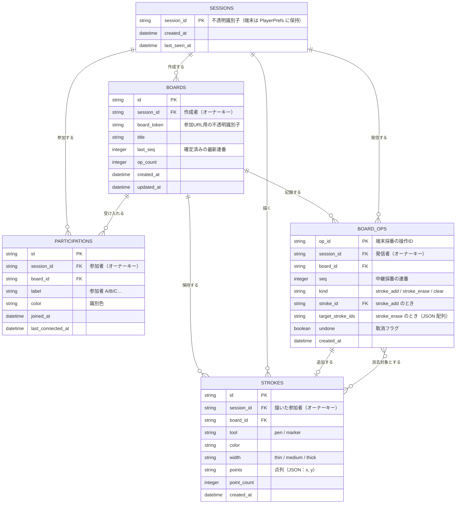

---

## 22. DFD

### 22.1 コンテキストレベル

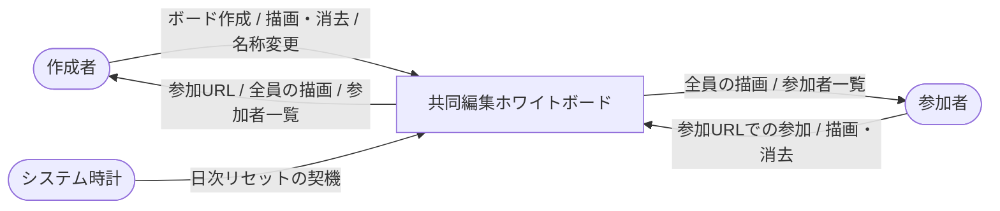

### 22.2 詳細レベル

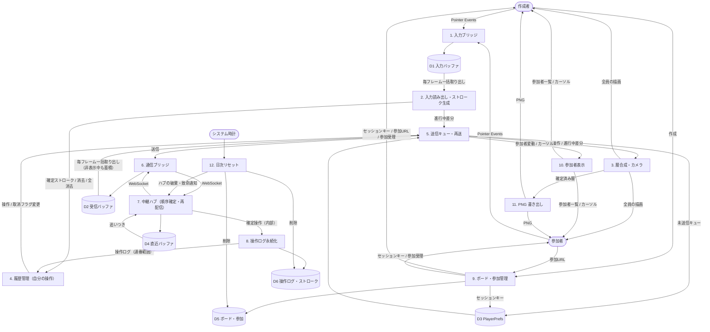

---

## 23. シーケンス図

### 23.1 起動とセッションの確立

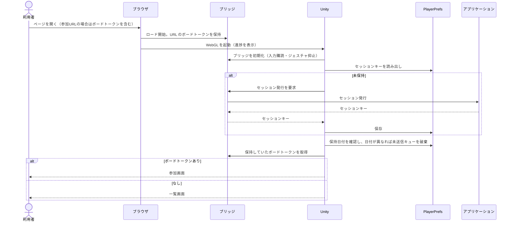

### 23.2 ボードの作成と参加

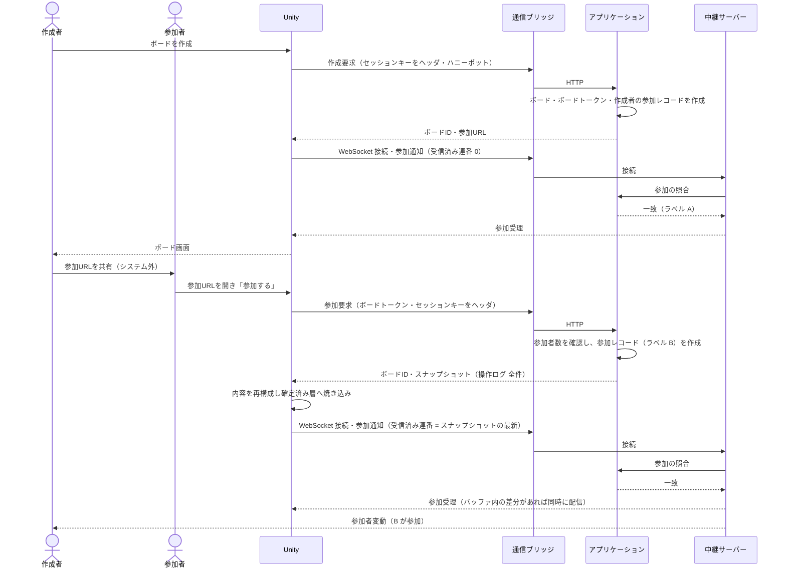

### 23.3 描画のリアルタイム配信と確定

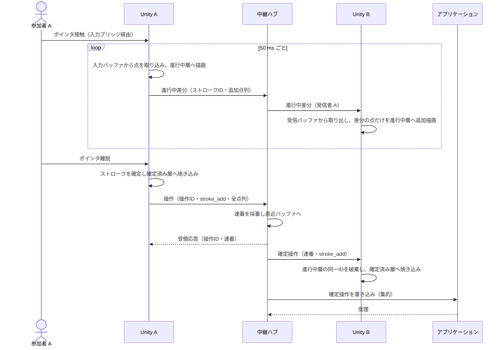

### 23.4 消去の競合

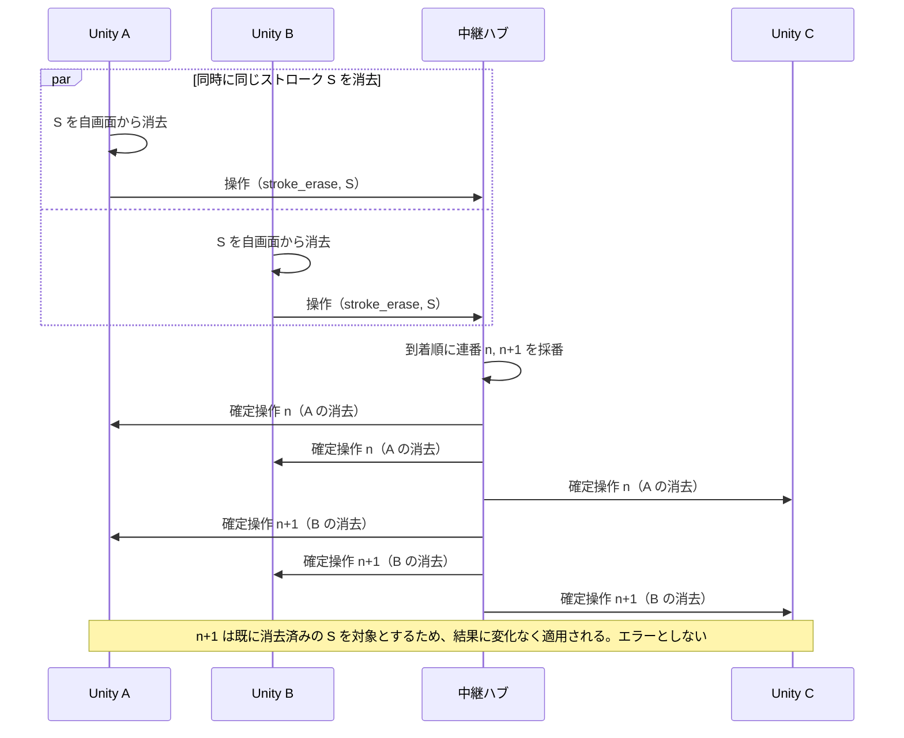

### 23.5 タブの非表示からの復帰

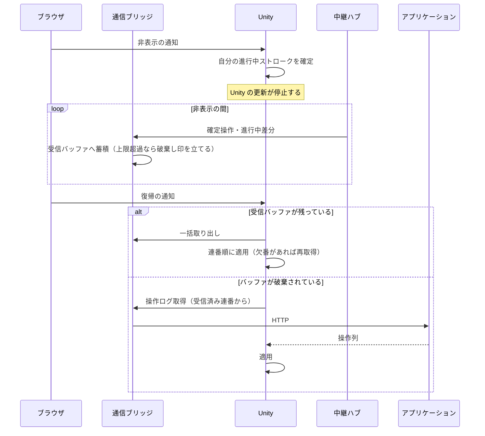

### 23.6 再接続と追いつき

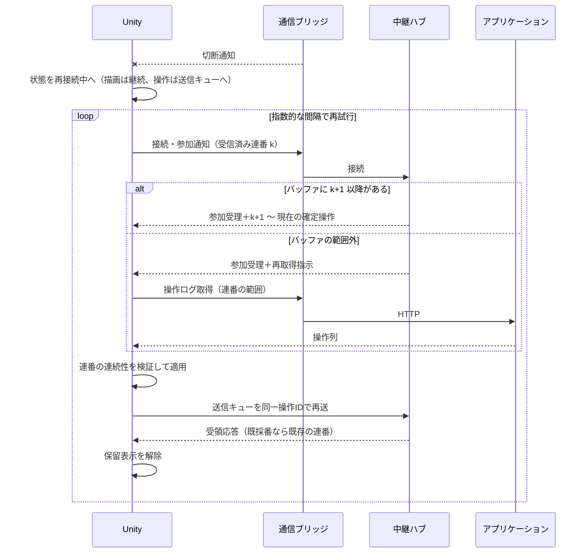

### 23.7 日次リセット

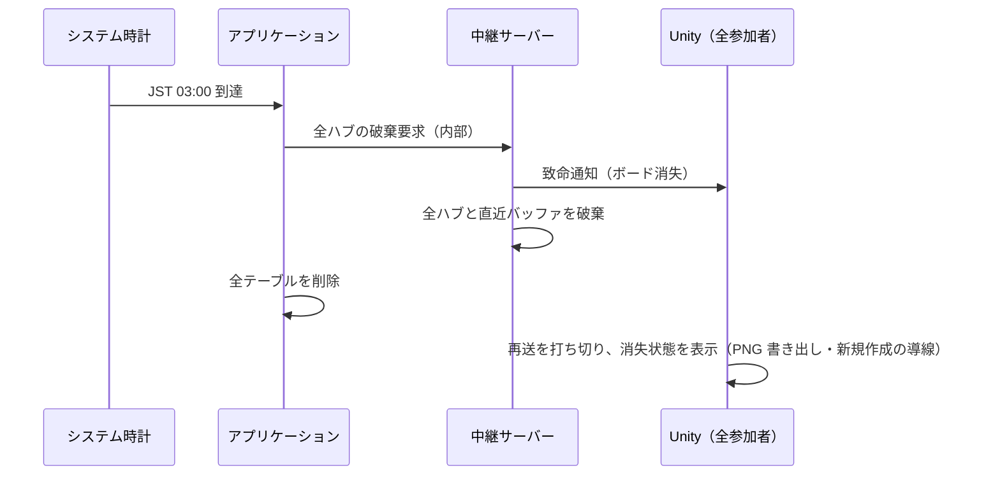

---

## 24. クラス図

```mermaid
classDiagram
  direction LR

  class InputBridge {
    <<jslib>>
    +subscribe(canvas)
    +drain() InputEvent[]
    +capture(pointerId)
  }

  class NetBridge {
    <<jslib>>
    +connect(url)
    +send(msg)
    +drain() Message[]
    +overflowed: bool
    +request(method, path, headers, body)
    +sendOnPageHide(msgs)
  }

  class EnvBridge {
    <<jslib>>
    +boardTokenFromUrl() string
    +onVisibility(callback)
    +onPageHide(callback)
    +download(bytes, filename)
  }

  class InputReader {
    +readFrame() InputEvent[]
  }

  class GestureRouter {
    +route(pointers) Mode
    +onSecondTouch()
  }

  class StrokeBuilder {
    +begin(tool, color, width)
    +addPoint(x, y)
    +pendingDelta() Point[]
    +finish() Stroke
    +abort()
  }

  class Stroke {
    +id: string
    +tool: Tool
    +color: Color
    +width: Width
    +points: Point[]
    +authorLabel: string
  }

  class RibbonMeshBuilder {
    +build(path, width) Mesh
  }

  class EraserHitTester {
    +hit(path, committedStrokes) StrokeId[]
  }

  class CameraController {
    +center: Vector2
    +zoom: float
    +toWorld(p) Vector2
    +pan(delta)
    +zoomAt(p, factor)
    +fitAll(strokes)
    +reset()
  }

  class LayerCompositor {
    +committed: RenderTexture
    +localActive: RenderTexture
    +remoteActive: RenderTexture
    +drawLocalActive(mesh)
    +appendRemoteDelta(strokeId, delta, color)
    +dropRemoteActive(strokeId)
    +bake(mesh, opacity)
    +rebuild(strokes)
    +resize(size, pixelRatio)
  }

  class BoardState {
    +strokes: StrokeMap
    +ops: Op[]
    +lastSeq: int
    +applyOp(op, seq)
    +applyUndoFlag(opId, undone)
    +visibleStrokes() Stroke[]
  }

  class Op {
    +opId: string
    +seq: int
    +kind: OpKind
    +authorLabel: string
    +strokeId: string
    +targetStrokeIds: string[]
    +undone: bool
  }

  class HistoryManager {
    +undoStack: Op[]
    +redoStack: Op[]
    +record(op)
    +undo() Op
    +redo() Op
    +rebuildFromOwn(ops)
  }

  class SyncClient {
    +state: ConnState
    +connect(sessionKey, boardToken, lastSeq)
    +sendActiveDelta(delta)
    +sendActiveAbort(strokeId)
    +sendOp(op)
    +sendUndoFlag(opId, undone)
    +sendCursor(p)
    +pumpMessages()
    +onVisibilityChange(visible)
    +reconnect()
  }

  class SendQueue {
    +pending: Op[]
    +enqueue(op)
    +ack(opId, seq)
    +resendAll()
    +persist()
    +restore()
    +flushOnPageHide()
  }

  class SeqGuard {
    +expected: int
    +accept(seq) bool
    +requestRefetch(from, to)
  }

  class PresenceView {
    +participants: ParticipantMap
    +updateCursor(label, p)
    +onJoin(label)
    +onLeave(label)
  }

  class ApiClient {
    +issueSession()
    +createBoard(title, honeypot)
    +joinByToken(token)
    +listBoards()
    +renameBoard(id, title)
    +fetchOps(boardId, fromSeq, toSeq)
  }

  class PrefsStore {
    +sessionKey
    +toolSettings
    +unsentQueue(boardId)
    +viewport(boardId)
    +heldDate
    +discardIfDateChanged()
  }

  class PngExporter {
    +export(visibleStrokes) byte[]
  }

  class UiBuilder {
    +buildLoading()
    +buildBoardList()
    +buildJoin()
    +buildBoard()
  }

  class ConnectionGateway {
    +accept(conn)
    +verify(sessionKey, boardToken) Participation
    +route(conn, msg)
  }

  class BoardHub {
    +boardId: string
    +connections: ConnSet
    +nextSeq: int
    +recentOps: RingBuffer
    +assignSeq(op) int
    +broadcast(msg, except)
    +catchUp(conn, fromSeq)
    +dropActiveOf(label)
    +close(reason)
  }

  class PersistWriter {
    +buffer(op)
    +flush()
    +onGap(from, to)
  }

  class RateLimiter {
    +allow(sessionKey) bool
  }

  class SessionAuth {
    +issue() SessionKey
    +fromHeader(request) SessionKey
  }

  class OwnerGuard {
    +scopeByParticipation(sessionKey) Query
    +verify(sessionKey, boardId) bool
  }

  class HoneypotFilter {
    +reject(form) bool
  }

  class BoardRepository {
    +create(sessionKey, title) Board
    +findByToken(token) Board
    +listParticipating(sessionKey)
    +rename(sessionKey, id, title)
  }

  class ParticipationRepository {
    +join(sessionKey, board) Participation
    +count(boardId) int
    +verify(sessionKey, boardToken) Participation
  }

  class OpRepository {
    +append(ops)
    +fetch(boardId, fromSeq, toSeq)
    +lastSeq(boardId) int
    +setUndone(opId, undone)
  }

  class DailyResetJob {
    +run()
    +requestHubShutdown()
    +purgeAll()
  }

  InputReader --> InputBridge
  InputReader --> GestureRouter
  InputReader --> StrokeBuilder
  GestureRouter --> CameraController
  StrokeBuilder --> Stroke
  StrokeBuilder --> LayerCompositor
  StrokeBuilder ..> SyncClient : 進行中差分
  LayerCompositor --> RibbonMeshBuilder
  LayerCompositor --> CameraController
  EraserHitTester --> BoardState
  StrokeBuilder ..> HistoryManager
  EraserHitTester ..> HistoryManager
  HistoryManager o-- Op
  HistoryManager --> SendQueue
  SendQueue --> SyncClient
  SendQueue --> PrefsStore
  SyncClient --> NetBridge
  SyncClient --> SeqGuard
  SyncClient --> BoardState
  SyncClient --> PresenceView
  SyncClient --> LayerCompositor
  SyncClient ..> EnvBridge : 非表示・終了
  BoardState o-- Op
  BoardState o-- Stroke
  BoardState --> LayerCompositor
  SeqGuard ..> ApiClient
  ApiClient --> NetBridge
  ApiClient --> PrefsStore
  PngExporter --> BoardState
  PngExporter --> EnvBridge
  UiBuilder --> SyncClient
  UiBuilder --> ApiClient
  NetBridge ..> ConnectionGateway : WebSocket
  NetBridge ..> SessionAuth : HTTP（ヘッダ）
  ConnectionGateway --> BoardHub
  ConnectionGateway ..> ParticipationRepository : 内部照合
  BoardHub --> PersistWriter
  BoardHub --> RateLimiter
  PersistWriter ..> OpRepository : 内部書き込み
  SessionAuth --> OwnerGuard
  SessionAuth --> HoneypotFilter
  OwnerGuard --> BoardRepository
  OwnerGuard --> ParticipationRepository
  OwnerGuard --> OpRepository
  DailyResetJob --> BoardRepository
  DailyResetJob --> OpRepository
  DailyResetJob ..> BoardHub : 破棄要求
```

---

## 25. 状態遷移図

### 25.1 接続状態

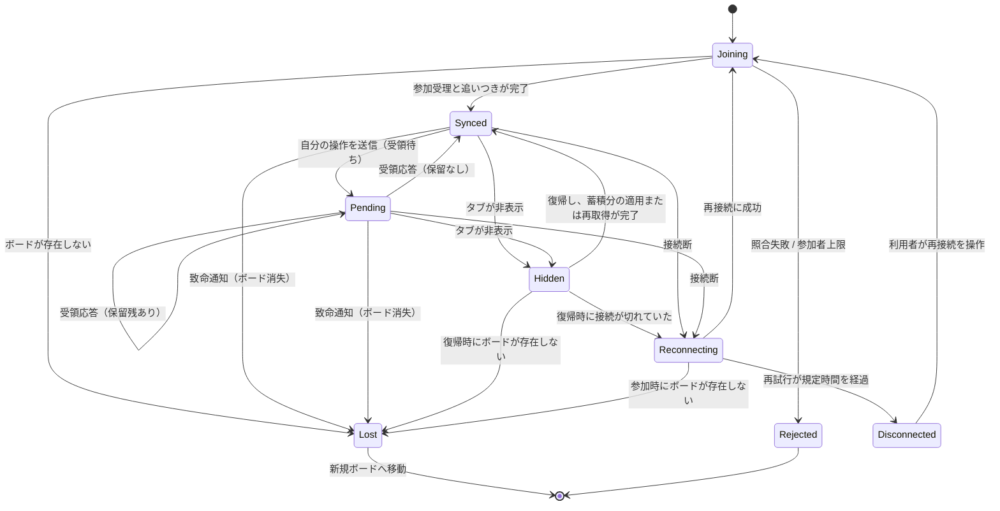

### 25.2 入力状態

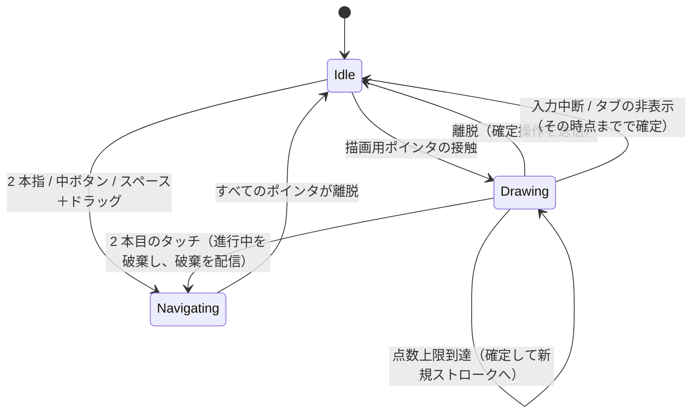

### 25.3 ストローク（全参加者から見た状態）

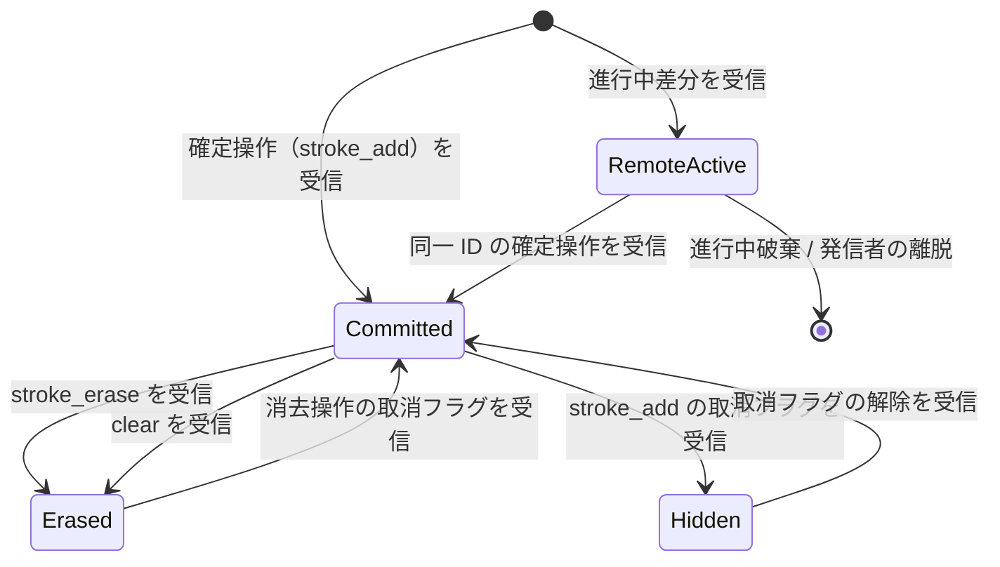

---

## 26. ユースケース図

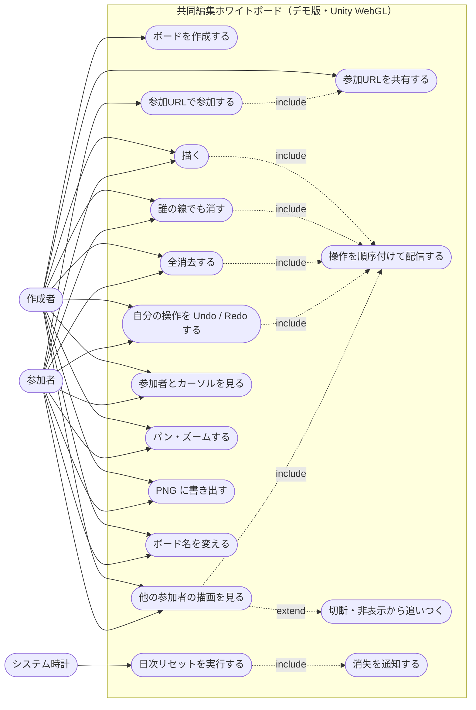

---

## 27. 非機能要件

| 区分 | 要件 |
|---|---|
| 実装方式 | 1 issue のワンショットで実装する |
| 外部通信 | 外部サービスへのネットワーク越しの呼び出しを行わない。API キーを必要とする通信を持たない |
| 即時性 | 描画中の点は 50 ms 以内に他の参加者へ送出すること。確定操作は取り出しから同一フレームで反映すること |
| 一貫性 | 全参加者が同じ連番順で操作を適用し、同じ結果に到達すること。欠番のまま後続を適用しないこと |
| 冪等性 | 同一操作 ID の再送で操作が重複登録・重複採番されないこと。消去済みの対象への消去がエラーにならないこと |
| 継続性 | 接続断・タブの非表示の間も内容を失わず、復帰後に欠落なく追いつくこと |
| 入力経路 | 入力源・通信経路をブリッジに一本化し、Unity 標準の経路と重複させないこと |
| 資源 | 確定済みストロークのメッシュを保持せず層に焼き込むこと。直近バッファ・受信バッファ・参加者数・操作数・点数・送信頻度に上限を設けること |
| 起動 | WebGL の読み込み中は進捗を表示し、完了前に入力を受け付けないこと。URL のボードトークンを読み込み完了まで保持すること |
| ビルド | シーン・UI・オブジェクトはすべてコードで生成し、Unity Editor の GUI 操作を不要とすること |

---

## 28. セキュリティ・個人情報

**セキュリティ**

- 認証・認可を設計に組み込まない
- セッションキーはアプリケーション層が発行する不透明識別子とし、端末は PlayerPrefs に保持してヘッダで送る。セッションキーをオーナーキーとして全テーブルに付与する
- セッションキーを URL に含めないこと。参加 URL にはボードトークンのみを含めること
- セッションをまたぐ参照・操作は、参加レコードを持つボードに限る。ボードトークンは推測不可能な長さとし、ボード ID・セッションキーから導出しないこと
- 中継サーバーは参加の照合に成功した接続のみを確立し、照合に用いたセッションキー・ボードトークンを接続ごとに保持して以後のメッセージに適用すること
- Bot 対策はハニーポット方式で行う。reCAPTCHA を用いない。加えて 1 セッションあたりの操作頻度・接続数に上限を設けること
- 受信したメッセージは種別・点数・座標の数値範囲・ペイロード長を検証し、逸脱するメッセージを破棄すること
- 中継・アプリケーション層は、配信元として Unity Play の配信元のみを受け入れること

**個人情報**

| 項目 | 扱い |
|---|---|
| 氏名・ニックネーム | 使用しない。参加者は非個人ラベル（参加者 A・B…）で表す |
| メールアドレス | 使用しない |
| 生年月日・住所・電話番号 | 使用しない |
| セッションキー | 端末識別子として扱う |
| 描画内容 | ストロークの点列としてのみ保持し、内容の解析・認識を行わない |
| カーソル位置 | 永続化せず、接続中の配信に限る |
| 端末情報 | 保存しない |

---

## 29. 運用要件

| 項目 | 内容 |
|---|---|
| DB | SQLite。デプロイ先を問わず SQLite を用いる |
| 日次リセット | JST 03:00 にアプリケーション層が全テーブルを削除する。実行前に中継サーバーへ全ハブの破棄を要求し、全参加者へ致命通知を配信したうえで削除する。端末側はページロード時に保持日付を確認し、日付が異なれば未送信キューを破棄する |
| 中継の状態 | ハブと直近バッファは揮発とし、中継サーバーの再起動時はアプリケーション層の最新連番から採番を再開する |
| 直近バッファ | 直近 500 件または 5 分間のいずれか短い方を保持する |
| ビルド | `Unity.exe -batchmode -nographics -executeMethod` による CLI ビルド。WebGL テンプレートにはブリッジの読み込みとジェスチャ抑止を含める |
| 配信 | フロントエンドは Unity Play、中継・アプリケーション層は Railway。Unity Play へのアップロードと Railway へのデプロイのみ人間が手動で行う |
| 測定 | 行わない |
| 保守・監視 | 行わない |

---

## 30. 対応環境と制約

| 項目 | 内容 |
|---|---|
| 対応ブラウザ | WebGL 2.0・Pointer Events・WebSocket に対応した最新世代のデスクトップ向けブラウザ |
| 対応入力 | マウス・トラックパッドを主とし、タッチ・ペンでも描画できる。筆圧・傾きは用いない |
| 非対応時の扱い | 起動時に WebGL 2.0 の可否を検出し、非対応の場合は起動せず、その旨を表示する |
| 前提 | 参加 URL はシステム外（口頭・チャット等）で共有する。URL を知る者は誰でも参加できる |
| 前提 | ボードは日次リセットまで存続し、以降は内容が失われる。永続的な保管を目的とした利用は想定しない |
| 前提 | 中継サーバーまたはアプリケーション層が無料枠で停止している間は共同編集が成立しない。その旨を接続状態として表示する |
| 前提 | ブラウザの永続領域を消去した場合、セッションキーが失われ、参加していたボードの一覧には到達できない。参加 URL を再度開けば新しい参加者として参加できる |
| 対象外 | スマートフォン・タブレットのブラウザ |
